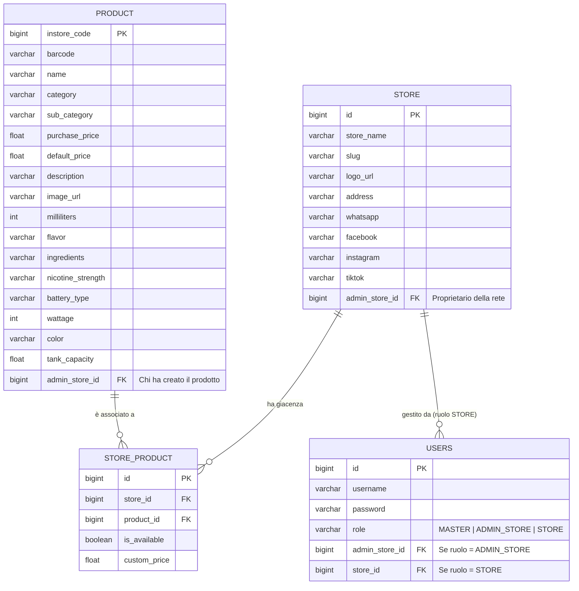
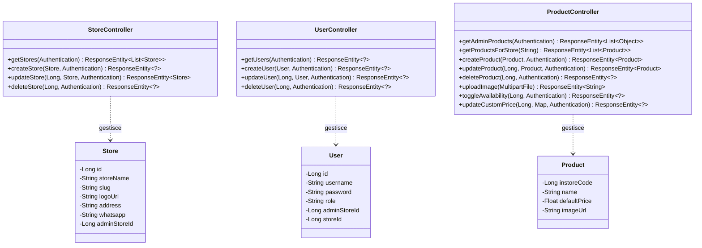

# Svapo Store Digital Catalog - Documentazione Tecnica (SaaS)

Questa documentazione illustra l'architettura, le tecnologie scelte, la struttura del software e le funzionalità implementate nello **Svapo Store Digital Catalog**. A seguito delle recenti modifiche, l'applicativo è ora strutturato come una piattaforma **SaaS Multi-tenant**, progettata per supportare più negozi indipendenti, raggruppabili sotto reti di franchising.

---

## 1. Architettura Generale e Stack Tecnologico

Il progetto segue un'architettura **Client-Server** moderna.

### 1.1 Frontend (Client)
Il frontend è progettato per essere veloce, reattivo ed esteticamente in stile Vercel.
*   **Libreria Principale:** React 19.
*   **Build Tool:** Vite.
*   **Styling:** Tailwind CSS.
*   **Routing:** React Router DOM (gestione della navigazione "Single Page Application"). Al percorso principale (`/`) corrisponde una landing page che indirizza l'utente allo store desiderato tramite URL Slug (es. `/store/milano`).
*   **Animazioni:** GSAP (GreenSock Animation Platform) per transizioni fluide.
*   **Icone:** Lucide React.

### 1.2 Backend (Server)
Il backend funge da API RESTful.
*   **Framework Principale:** Java 21 con Spring Boot 3.2.x.
*   **Data Access:** Spring Data JPA (Hibernate) su database relazionale.
*   **Sicurezza:** Spring Security abbinato a JWT (JSON Web Tokens) con ruoli gerarchici (`MASTER`, `ADMIN_STORE`, `STORE`).
*   **Database:** H2 Database in-memory, predisposto per MySQL.

---

## 2. Architettura Multi-tenant e Ruoli

La logica di dominio (Domain Layer) è stata estesa per supportare una gerarchia di rete:

*   **Entità `Store`**: Rappresenta il singolo punto vendita (es. "VapeStore Roma", "VapeStore Milano"). Ogni store possiede un URL univoco (Slug), configurazioni personalizzate (Logo, Indirizzo, contatti Social/WhatsApp) e appartiene ad un `AdminStoreId`.
*   **Entità `Product`**: Catalogo globale dei prodotti disponibili nel sistema (creati da MASTER o ADMIN_STORE).
*   **Entità `StoreProduct`**: Tabella di relazione molti-a-molti (Pivot) che lega un prodotto a uno specifico Store. Permette ad ogni negozio di avere la propria giacenza (visibilità del prodotto) e un proprio prezzo personalizzato (`customPrice`).
*   **Entità `User`**: Gestisce gli accessi. Include un campo `role` per distinguere i permessi e le relazioni gerarchiche.

### 2.1 Gerarchia dei Ruoli (Access Control)
L'applicazione implementa tre livelli di privilegi:
1.  **MASTER (Amministratore di Sistema):**
    *   Visione e controllo totale.
    *   Può creare/modificare/eliminare sia i gruppi di Negozi (`Store`) che gli Utenti assegnando loro un ruolo e ID specifici.
2.  **ADMIN_STORE (Proprietario Rete/Franchising):**
    *   Gestisce il catalogo globale ("Globali") disponibile per i suoi negozi associati.
    *   Può aggiungere nuovi prodotti per la propria rete, oltre a poterli oscurare o variare.
3.  **STORE (Punto Vendita Singolo):**
    *   Vede solo il "Catalogo Locale".
    *   Non può creare prodotti nuovi da zero. Può solo prendere prodotti resi disponibili dal suo ADMIN_STORE, scegliere se mostrarli o nasconderli nel proprio negozio, ed eventualmente sovrascrivere il prezzo di listino.
    *   Gestisce le impostazioni del proprio negozio (Nome, Indirizzo, Logo, Social).

---

## 3. Classi, Funzioni e Controller

### 3.1 Controller (Rotte API Backend)

Ogni Controller nel backend definisce le API esposte al frontend, proteggendole tramite le autorizzazioni di `Spring Security` configurate in `WebSecurityConfig` e nell'`AuthTokenFilter`.

#### `StoreController.java` (`/api/stores`)
Gestisce i punti vendita.
*   `getStores(Authentication)`: (Metodo `GET`) Ritorna la lista degli store. Il payload restituito è filtrato in base al ruolo del token JWT che effettua la richiesta. Se è un `MASTER`, ritorna tutti gli store; se `ADMIN_STORE` solo quelli legati al suo ID; se `STORE`, solo sé stesso.
*   `createStore(@RequestBody Store newStore, Authentication)`: (Metodo `POST`) Accessibile solo a `MASTER` e `ADMIN_STORE`. Crea un nuovo negozio nel database. Se l'utente è `ADMIN_STORE`, l'ID della rete viene automaticamente impostato con il proprio.
*   `updateStore(@PathVariable Long id, @RequestBody Store storeDetails, Authentication)`: (Metodo `PUT`) Aggiorna le configurazioni (nome, logo, indirizzo, social) di un negozio specifico. Effettua un controllo di permessi (`STORE` e `ADMIN_STORE` possono modificare solo ciò che gli appartiene).
*   `deleteStore(@PathVariable Long id, Authentication)`: (Metodo `DELETE`) Accessibile solo a `MASTER`. Grazie all'annotazione `@Transactional`, questa funzione prima istruisce `StoreProductRepository` di cancellare tutti i record nella tabella pivot legati allo store (per evitare violazioni di chiavi esterne), e successivamente elimina lo store stesso.

#### `UserController.java` (`/api/users`)
Gestisce le utenze del sistema. **Tutti** i metodi in questa classe sono limitati esclusivamente al ruolo `MASTER`.
*   `getUsers(Authentication)`: Ritorna l'intera anagrafica degli utenti registrati nel sistema.
*   `createUser(@RequestBody User newUser, Authentication)`: Crea un utente, criptando la password in ingresso con `PasswordEncoder` (Bcrypt) prima di inviarla al database.
*   `updateUser(@PathVariable Long id, @RequestBody User userDetails, ...)`: Modifica le anagrafiche (Ruolo, ID Assegnati). Se viene passata una nuova password, si occupa di criptarla nuovamente aggiornando il campo.
*   `deleteUser(@PathVariable Long id, ...)`: Elimina un utente dal sistema.

#### `ProductController.java` (`/api/products` & `/api/public/stores`)
*   `getProductsForStore(@PathVariable String slug)`: Rotta pubblica (`/api/public/stores/{slug}/products`) invocata dal Frontend (Customer View). Ritorna solo i prodotti esplicitamente flaggati come visibili (`is_available = true`) per lo store richiesto tramite il suo identificativo testuale (slug). Se lo store ha impostato un `customPrice`, questo sovrascrive il listino.
*   `getAdminProducts(Authentication)`: Usata dalla Dashboard. Restituisce il catalogo in base ai permessi (Globale per ADMIN, o mischiato con visibilità/prezzo locale per lo STORE).

---

## 4. Frontend: Dashboard Admin (React)

L'`AdminDashboard.jsx` è il nucleo centrale gestionale. Si adatta graficamente (Conditional Rendering) in base al ruolo dell'utente (`userRole` salvato nel LocalStorage durante il Login).

### 4.1 UI del Ruolo MASTER
Mostra il titolo "Area Master - Gestione Sistema" con due Tab navigabili:
*   **Gestione Utenti:** Un form (`onSubmit`) e una tabella con le anagrafiche per effettuare il CRUD sugli Utenti, collegandosi a `UserController`. I pulsanti "Modifica" (Edit) e "Elimina" (Trash) richiamano stati specifici (`setEditingUser`) e metodi API (DELETE su `/users/{id}`).
*   **Gestione Stores:** Medesima struttura dedicata agli Store, interfacciandosi con lo `StoreController`.

### 4.2 UI dei Ruoli ADMIN_STORE / STORE
*   I ruoli operativi vedono l'interfaccia catalogo.
*   **Se l'utente è `STORE`**: L'interfaccia si intitola "Catalogo Locale". Al posto dei pulsanti globali di cancellazione prodotto, compaiono interruttori (`Eye / EyeOff`) per invocare un aggiornamento al backend e cambiare lo stato di disponibilità (`is_available`) di un prodotto all'interno del proprio negozio. Modificando un prodotto, l'utente STORE non sovrascrive i dettagli base (che restano dell'ADMIN_STORE), ma altera solo il proprio `customPrice`.
*   **Pannello Impostazioni:** Un pannello scorrevole laterale dedicato a modificare le info (nome, logo, link Whatsapp) che i clienti finali vedranno nel footer e nell'header quando atterrano sull'URL del negozio (es: `/store/roma`).

## 5. Dati di Sviluppo (`data.sql`)
Al boot, Spring Boot inizializza il database in-memory con un'enorme quantità di mock data derivati da operazioni di web scraping. Questi file contengono centinaia di prodotti reali (con URL immagine validi puntati ai CDN dei distributori originali, sostituiti rispetto ai vecchi placeholder SVG) oltre alla struttura base dei test:
*   L'utente `master` (pw: admin123).
*   L'utente `admin` (pw: admin123).
*   L'utente `store_roma` (pw: admin123) legato allo store Roma.

---

## 6. Diagrammi di Progetto

Di seguito sono riportati i diagrammi UML ed ER generati per la piattaforma SaaS, utilizzando la sintassi Mermaid.

### 6.1 Diagramma Entità-Relazione (ER DB Schema)

### 6.2 UML Class Diagram (Backend Controllers)

